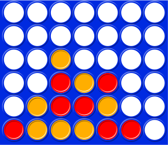

# PUISSANCE 4

Le **puissance 4** est un jeu bien connu à deux joueurs qui se joue sur une grille verticale de **six lignes et sept colonnes**. À tour de rôle, chaque joueur fait tomber un pion de sa couleur dans une colonne de son choix non encore pleine.

Le premier joueur qui aligne quatre pions de sa couleur, *horizontalement, verticalement ou en diagonale*, gagne la partie. La partie est nulle si la grille est totalement remplie sans qu'aucun joueur ne gagne.

